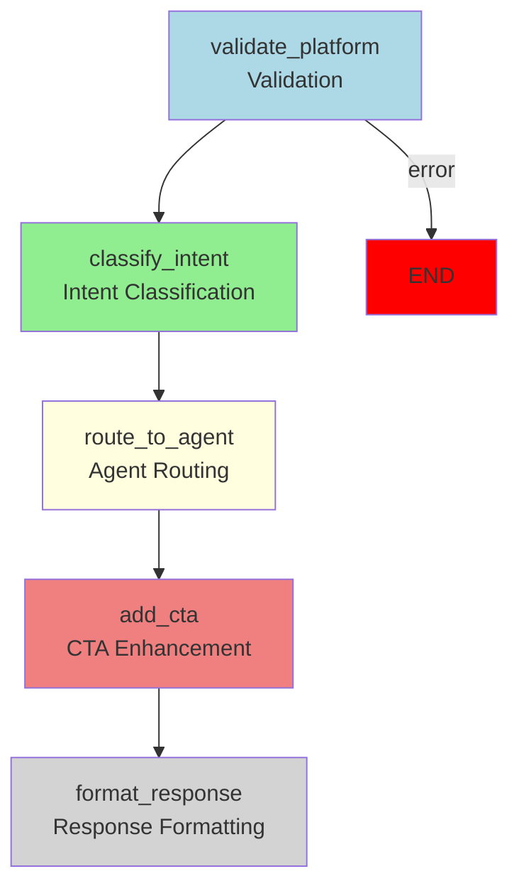

# 🧠 TripC.AI Chatbot API

Platform-aware AI chatbot for TripC ecosystem with **LangGraph-based workflow architecture**.

## 🚀 Features

### ✅ **LangGraph Workflow Architecture (v1.0)**
- **Visual Workflow**: 5-node workflow with conditional error handling
- **State Management**: Centralized state handling across workflow nodes
- **Error Handling**: Graceful error handling with early termination
- **Extensibility**: Easy to add new nodes and modify flow
- **Debugging**: Better visibility into workflow execution

### 🏗️ **Platform-Aware Architecture**
- **Multi-Platform Support**: Web browsers + Mobile apps
- **Device Detection**: Desktop, Android, iOS
- **Language Support**: Vietnamese (vi) + English (en)
- **Platform Validation**: Ensures valid platform-device combinations

### 🎯 **App-First Service Strategy**
- **No Individual URLs**: Services don't have webURL/deeplink fields
- **App-Centric Access**: Service details only accessible via TripC Mobile App
- **CTA-Driven Navigation**: Platform-specific CTAs drive app adoption

### 🧠 **AI Agent System**
- **QnA Agent**: Vector embedding search with pre-indexed content
- **Service Agent**: TripC API integration for real-time service data
- **LangGraph Orchestrator**: Visual workflow with state management
- **Embedding Sources**: imageURL và sources từ pre-indexed embedding data

### 🎗️ **CTA System Engine**
- **Web Browser CTAs**: Device-specific app download URLs
- **Mobile App CTAs**: Deeplinks for in-app navigation
- **Smart Routing**: Platform-aware CTA selection logic

### 🏢 **TripC API Integration**
- **Restaurant Services**: Direct integration with TripC restaurant APIs
- **Authentication**: Bearer token authentication
- **Data Mapping**: TripC API fields → Chatbot response format
- **Keyword Analysis**: LLM-powered keyword extraction and product type matching
- **Smart Search**: Product type ID matching based on user queries (no fallback)

### 📧 **Email Booking Service**
- **Workflow**: User info → Email to `booking@tripc.ai` → Confirmation email
- **SMTP Fallback**: Graceful handling when SMTP not configured
- **Action Trigger**: Activated via `collect_user_info` action

## 🏗️ LangGraph Workflow Architecture



### 🔄 **Workflow Nodes**

1. **Platform Validation** - Validates platform-device compatibility
2. **Intent Classification** - Classifies user intent (QnA, Service, Booking)
3. **Agent Routing** - Routes to appropriate AI agent
4. **CTA Enhancement** - Adds platform-specific call-to-action
5. **Response Formatting** - Formats final response

### 🚨 **Error Handling**

- **Early Termination**: Platform validation errors stop workflow immediately
- **Graceful Fallbacks**: Agent errors are caught and formatted as error responses
- **User Guidance**: All errors include retry suggestions

## 📁 Project Structure

```
tripc-chatbot-api/
├── src/
│   └── app/
│       ├── main.py                 # FastAPI application with LangGraph endpoints
│       ├── core/
│       │   ├── platform_context.py # Platform detection & validation
│       │   ├── cta_engine.py       # Platform-specific CTA system
│       │   ├── langgraph_workflow.py # LangGraph workflow orchestration
│       │   └── workflow_visualizer.py # Workflow visualization tools
│       ├── agents/
│       │   ├── qna_agent.py        # QnA with embedding search
│       │   └── service_agent.py    # TripC API integration
│       ├── services/
│       │   ├── email_service.py    # Booking workflow
│       │   ├── tripc_api.py        # TripC API client
│       │   └── keyword_analyzer.py # LLM-powered keyword analysis
│       ├── vector/
│       │   └── pgvector_store.py   # Vector embedding storage
│       ├── models/
│       │   ├── schemas.py          # Request/response models
│       │   └── platform_models.py  # Platform context models
│       ├── llm/
│       │   └── qwen_client.py      # AI agent LLM integration
│       └── database/
│           └── postgresql.py       # Chat history & user data
├── tests/                          # Test suite
├── langgraph_docs/                 # Generated workflow documentation
├── requirements.txt                 # Python dependencies
├── pyproject.toml                  # Project configuration
├── demo.py                         # Original API demo
├── langgraph_demo.py               # LangGraph workflow demo
└── README.md                       # This file
```

## 🚀 Quick Start

### 1. Install Dependencies

```bash
pip install -r requirements.txt
```

### 2. Environment Variables

Create `.env` file:

```bash
# TripC API Configuration
TRIPC_API_BASE_URL=https://api.tripc.ai
TRIPC_API_TOKEN=your_access_token_here

# SMTP Configuration (Optional)
SMTP_SERVER=smtp.gmail.com
SMTP_PORT=587
SMTP_USERNAME=your_email@gmail.com
SMTP_PASSWORD=your_app_password
BOOKING_EMAIL=booking@tripc.ai
FROM_EMAIL=noreply@tripc.ai
```

### 3. Run the API

```bash
# Development mode
python -m uvicorn src.app.main:app --reload --host 0.0.0.0 --port 8000

# Production mode
python -m uvicorn src.app.main:app --host 0.0.0.0 --port 8000
```

### 4. Access the API

- **API Documentation**: http://localhost:8000/docs
- **Health Check**: http://localhost:8000/health
- **Status**: http://localhost:8000/api/v1/status
- **Session Stats**: http://localhost:8000/api/v1/session/stats
- **Workflow Graph**: http://localhost:8000/api/v1/workflow/graph

## 🔧 Session Management

The chatbot now includes **automatic session management** to prevent message mixing between different users:

- **Auto-generated conversation IDs** for each user
- **Session tracking and cleanup** 
- **User identification** via headers or IP/User-Agent
- **Session statistics** API endpoints

See [SESSION_MANAGEMENT_FIX.md](SESSION_MANAGEMENT_FIX.md) for detailed documentation.

### Test Session Management
```bash
python test_session_management.py
```

## 🎯 LangGraph Workflow Demo

Run the LangGraph workflow demo:

```bash
python langgraph_demo.py
```

This will:
- ✅ Initialize LangGraph workflow
- ✅ Test different request types
- ✅ Generate workflow visualizations
- ✅ Create documentation files

## 📡 API Endpoints

### POST `/api/v1/chatbot/response`

Main chatbot endpoint with **LangGraph workflow processing**.

**Request:**
```json
{
  "message": "Tìm nhà hàng gần đây",
  "platform": "web_browser",
  "device": "android",
  "language": "vi"
}
```

**Response:**
```json
{
  "type": "Service",
  "answerAI": "Dưới đây là những nhà hàng tuyệt vời tại Đà Nẵng:",
  "services": [
    {
      "id": 11,
      "name": "Bông",
      "type": "restaurant",
```

### POST `/api/v1/restaurants/search-with-analysis`

Tìm kiếm nhà hàng với phân tích từ khóa và product_type_id.

**Request:**
```json
{
  "query": "Tôi muốn tìm nhà hàng hải sản ở Đà Nẵng",
  "page": 1,
  "page_size": 15
}
```

**Response:**
```json
{
  "status": "success",
  "data": {
    "restaurants": [...],
    "analysis": {
      "user_query": "Tôi muốn tìm nhà hàng hải sản ở Đà Nẵng",
      "keywords": {
        "proper_nouns": ["Đà Nẵng"],
        "adjectives": [],
        "common_nouns": ["nhà hàng", "hải sản"]
      },
      "matching_product_type_ids": [22, 15],
      "province_ids": [4, 47],
      "total_product_types": 45
    },
    "total_found": 12
  },
  "timestamp": "2024-01-15T10:30:00"
}
```

### POST `/api/v1/keywords/analyze`

Phân tích từ khóa từ câu hỏi người dùng.

**Request:**
```json
{
  "query": "Tìm quán cà phê view đẹp"
}
```

**Response:**
```json
{
  "status": "success",
  "data": {
    "user_query": "Tìm quán cà phê view đẹp",
    "keywords": {
      "proper_nouns": [],
      "adjectives": ["đẹp"],
      "common_nouns": ["quán", "cà phê", "view"]
    },
    "matching_product_type_ids": [8, 12],
    "province_ids": [4, 47],
    "total_product_types": 45
  },
  "timestamp": "2024-01-15T10:30:00"
}
      "imageUrl": "https://tripc-dev.s3.amazonaws.com/...",
      "address": "500 Núi Thành, Hải Châu, Đà Nẵng",
      "description": "Quán Bông có không gian thoáng mát...",
      "priceRange": "$$"
    }
  ],
  "cta": {
    "device": "android",
    "label": "Tải app TripC để xem chi tiết",
    "url": "https://play.google.com/store/apps/details?id=com.tripc.ai.app"
  }
}
```


## 🔧 Configuration

### Platform Types
- `web_browser`: Web browser users
- `mobile_app`: TripC mobile app users

### Device Types
- `desktop`: Desktop computers
- `android`: Android devices
- `ios`: iOS devices

### Language Support
- `vi`: Vietnamese
- `en`: English

### Platform-Device Compatibility
- `web_browser` + `desktop`: ✅ Valid
- `web_browser` + `android`: ✅ Valid
- `web_browser` + `ios`: ✅ Valid
- `mobile_app` + `android`: ✅ Valid
- `mobile_app` + `ios`: ✅ Valid
- `mobile_app` + `desktop`: ❌ Invalid

## 🎯 CTA Logic

### Web Browser Users
| Device | CTA Action | URL |
|--------|------------|-----|
| Desktop | General app download | `https://tripc.ai/mobileapp` |
| Android | Google Play Store | `https://play.google.com/store/apps/details?id=com.tripc.ai.app` |
| iOS | App Store | `https://apps.apple.com/vn/app/tripc-app/id6745506417` |

### Mobile App Users
| Device | CTA Action | Deeplink |
|--------|------------|----------|
| Android | In-app navigation | `tripc://restaurant/{id}` |
| iOS | In-app navigation | `tripc://restaurant/{id}` |

## 🧪 Testing

### Run Test Suite
```bash
pytest tests/
```

### Run Keyword Analyzer Test
```bash
python test_keyword_analyzer.py
```

### Run Keyword Analyzer Demo
```bash
python demo_keyword_analyzer.py
```

### Run LangGraph Demo
```bash
python langgraph_demo.py
```

### Run Original API Demo
```bash
python demo.py
```

## 🚀 Deployment

### Docker (Recommended)

```dockerfile
FROM python:3.11-slim

WORKDIR /app
COPY requirements.txt .
RUN pip install -r requirements.txt

COPY src/ ./src/
EXPOSE 8000

CMD ["python", "-m", "uvicorn", "src.app.main:app", "--host", "0.0.0.0", "--port", "8000"]
```

### Environment Variables for Production

```bash
# Required
TRIPC_API_BASE_URL=https://api.tripc.ai
TRIPC_API_TOKEN=production_token

# Optional but recommended
SMTP_SERVER=smtp.gmail.com
SMTP_PORT=587
SMTP_USERNAME=production_email
SMTP_PASSWORD=production_password
BOOKING_EMAIL=booking@tripc.ai
FROM_EMAIL=noreply@tripc.ai
```

## 📊 Monitoring

### Health Check
```bash
curl http://localhost:8000/health
```

### System Status
```bash
curl http://localhost:8000/api/v1/status
```


### Vector Store Stats
```bash
curl http://localhost:8000/api/v1/vector/stats
```

## 🔒 Security

- **Input Validation**: All requests validated with Pydantic models
- **Platform Validation**: Ensures valid platform-device combinations
- **Error Handling**: Graceful error handling without exposing internals
- **CORS**: Configurable CORS middleware for cross-origin requests

 

## 🤝 Contributing

1. Fork the repository
2. Create a feature branch
3. Make your changes
4. Add tests
5. Submit a pull request

## 📄 License

This project is licensed under the MIT License - see the LICENSE file for details.

## 📞 Support

- **Technical Issues**: Create an issue on GitHub
- **Business Inquiries**: Contact dev@tripc.ai
- **Documentation**: https://docs.tripc.ai

---

> 🎯 **Built with ❤️ by the TripC Team** - Platform-aware, app-first AI chatbot with **LangGraph workflow architecture** for the modern travel ecosystem.
