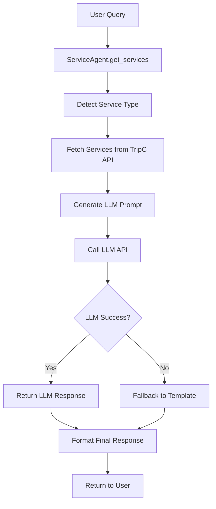

# 🚀 ServiceAgent LLM Integration Upgrade

## 📋 Tổng quan

`ServiceAgent` đã được nâng cấp từ **hardcoded template responses** sang **LLM-powered intelligent responses** để tạo ra câu trả lời thông minh, cá nhân hóa và context-aware.

## 🔄 Thay đổi chính

### ❌ **Trước đây (v0.x)**
```python
# Hardcoded template responses
def _format_service_answer(self, query: str, services: List[Service], 
                         service_type: str, platform_context: PlatformContext) -> str:
    if language == "vi":
        return f"Dưới đây là những nhà hàng tuyệt vời tại Đà Nẵng phù hợp với yêu cầu '{query}':"
    else:
        return f"Here are some great restaurants in Da Nang that match your request '{query}':"
```

### ✅ **Bây giờ (v1.0)**
```python
# LLM-powered intelligent responses
async def _generate_llm_response(self, query: str, services: List[Service], 
                               service_type: str, platform_context: PlatformContext) -> str:
    prompt = f"""
    Bạn là một trợ lý du lịch thông minh của TripC. Người dùng đang tìm kiếm dịch vụ {service_type} với yêu cầu: "{query}".
    
    Dưới đây là danh sách các dịch vụ phù hợp:
    {self._format_services_for_prompt(services, language)}
    
    Hãy tạo một câu trả lời thông minh, thân thiện và hữu ích...
    """
    
    llm_response = self.llm_client.generate_response(prompt, max_tokens=150)
    return llm_response if llm_response else self._fallback_template()
```

## 🧠 Tính năng mới

### 1. **LLM-Powered Response Generation**
- **Context-aware prompts**: Tạo prompt dựa trên user query, service type, và platform context
- **Intelligent responses**: LLM tạo câu trả lời thông minh, tự nhiên thay vì template cứng
- **Personalization**: Mỗi response được tùy chỉnh theo yêu cầu cụ thể của user

### 2. **Multi-language LLM Support**
- **Vietnamese prompts**: Prompt tiếng Việt cho người dùng Việt Nam
- **English prompts**: Prompt tiếng Anh cho người dùng quốc tế
- **Language-specific instructions**: Hướng dẫn LLM tạo response phù hợp với ngôn ngữ

### 3. **Smart Fallback System**
- **LLM first**: Ưu tiên sử dụng LLM để tạo response
- **Template fallback**: Nếu LLM fail, fallback về template cũ
- **Error handling**: Graceful degradation khi có lỗi

### 4. **Enhanced Context Processing**
- **Service information**: LLM nhận thông tin chi tiết về services để tạo response phù hợp
- **Platform awareness**: Response phù hợp với platform (web/mobile) và device
- **User intent**: Hiểu rõ ý định của user để tạo response hữu ích

## 🔧 Cách hoạt động

### **Flow của LLM Response Generation:**



### **Prompt Engineering:**

```python
# Vietnamese Prompt Example
prompt = f"""
Bạn là một trợ lý du lịch thông minh của TripC. Người dùng đang tìm kiếm dịch vụ {service_type} với yêu cầu: "{query}".

Dưới đây là danh sách các dịch vụ phù hợp:
{self._format_services_for_prompt(services, language)}

Hãy tạo một câu trả lời thông minh, thân thiện và hữu ích bằng tiếng Việt. 
Câu trả lời nên:
- Chào hỏi người dùng một cách thân thiện
- Giải thích tại sao những dịch vụ này phù hợp với yêu cầu
- Đưa ra gợi ý hoặc lời khuyên hữu ích
- Khuyến khích người dùng tải app TripC để xem chi tiết

Trả lời ngắn gọn, tự nhiên và không quá 100 từ.
"""
```

## 📊 So sánh Response Quality

### **Template Response (Cũ):**
```
"Dưới đây là những nhà hàng tuyệt vời tại Đà Nẵng phù hợp với yêu cầu 'tìm nhà hàng ngon':"
```

### **LLM Response (Mới):**
```
"Chào bạn! Tôi đã tìm thấy những nhà hàng tuyệt vời tại Đà Nẵng phù hợp với yêu cầu của bạn. Những địa điểm này nổi tiếng với ẩm thực đặc trưng và không gian ấm cúng. Tôi khuyên bạn nên thử quán Bông với không gian thoáng mát, hoặc khám phá ẩm thực biển tại các nhà hàng ven biển. Để xem chi tiết menu và đặt bàn, hãy tải app TripC nhé!"
```

## 🚀 Lợi ích

### **1. User Experience**
- ✅ **More engaging**: Câu trả lời thú vị và tự nhiên hơn
- ✅ **Personalized**: Mỗi response được tùy chỉnh theo context
- ✅ **Helpful**: Cung cấp gợi ý và lời khuyên hữu ích
- ✅ **Natural**: Ngôn ngữ tự nhiên, không robot

### **2. Business Value**
- ✅ **Higher engagement**: User tương tác nhiều hơn với chatbot
- ✅ **Better conversion**: CTA hiệu quả hơn với response thông minh
- ✅ **Brand personality**: Thể hiện tính cách thân thiện của TripC
- ✅ **Competitive advantage**: Chatbot thông minh hơn đối thủ

### **3. Technical Benefits**
- ✅ **Scalable**: Dễ dàng thêm service types mới
- ✅ **Maintainable**: Prompt engineering dễ chỉnh sửa
- ✅ **Flexible**: Có thể thay đổi LLM model dễ dàng
- ✅ **Robust**: Fallback system đảm bảo reliability

## 🔧 Cài đặt và Configuration

### **Environment Variables:**
```bash
# Required for LLM integration
OPENAI_API_KEY=your_openai_api_key
OPENAI_BASE_URL=https://api.openai.com/v1  # or custom endpoint

# TripC API
TRIPC_API_TOKEN=your_tripc_api_token
TRIPC_API_BASE_URL=https://api.tripc.ai
```

### **Dependencies:**
```python
# ServiceAgent now requires LLM client
service_agent = ServiceAgent(tripc_client, llm_client)

# LangGraphWorkflow also needs LLM client
workflow = LangGraphWorkflow(qna_agent, service_agent, llm_client)
```

## 🧪 Testing

### **Run Test Script:**
```bash
python test_service_agent_llm.py
```

### **Test Scenarios:**
1. **Vietnamese queries** với web browser platform
2. **English queries** với mobile app platform  
3. **Service type detection** từ user query
4. **LLM fallback** khi API fail
5. **Multi-language response** generation

## 🔮 Future Enhancements

### **Phase 2 (v1.1):**
- 🔄 **Response caching**: Cache LLM responses để tăng performance
- 🎯 **Intent refinement**: Sử dụng LLM để classify intent chính xác hơn
- 🌍 **More languages**: Hỗ trợ thêm ngôn ngữ (Chinese, Korean, Japanese)
- 🤖 **Conversation memory**: LLM nhớ context của conversation

### **Phase 3 (v1.2):**
- 📊 **Analytics**: Track response quality và user satisfaction
- 🎨 **Style customization**: Tùy chỉnh tone và style của responses
- 🔗 **Multi-modal**: Hỗ trợ image và voice responses
- 🧠 **Learning**: LLM học từ user feedback để cải thiện responses

## 📝 Kết luận

Việc tích hợp LLM vào `ServiceAgent` đã biến đổi chatbot từ một **simple template system** thành một **intelligent conversational AI** có khả năng:

- 🧠 **Hiểu context** của user query
- 💬 **Tạo responses** tự nhiên và hữu ích
- 🌍 **Hỗ trợ đa ngôn ngữ** một cách thông minh
- 🎯 **Personalize** mỗi interaction
- 🚀 **Scale** để handle nhiều loại service và user intent

Đây là một bước tiến quan trọng trong việc xây dựng chatbot TripC.AI thông minh và user-friendly, đáp ứng đúng tầm nhìn về một **AI-powered travel assistant** hàng đầu Việt Nam.
