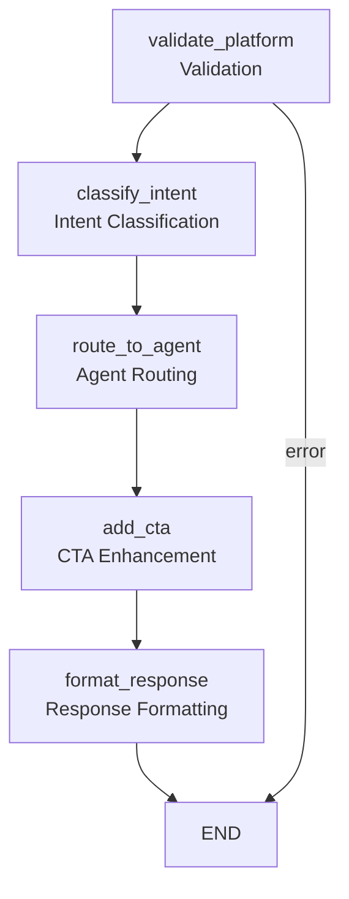

# TripC.AI Chatbot - LangGraph Workflow

## Workflow Diagram

## Workflow Description

This LangGraph workflow processes chatbot requests through the following steps:

1. **Platform Validation** - Validates platform-device compatibility
2. **Intent Classification** - Classifies user intent (QnA, Service, Booking)
3. **Agent Routing** - Routes to appropriate AI agent
4. **CTA Enhancement** - Adds platform-specific call-to-action
5. **Response Formatting** - Formats final response

## Error Handling

- Platform validation errors terminate the workflow early
- Agent errors are caught and formatted as error responses
- All errors include retry suggestions for users

## Benefits of LangGraph

- **Visual Workflow**: Clear visualization of request processing
- **State Management**: Centralized state handling across nodes
- **Error Handling**: Graceful error handling with early termination
- **Extensibility**: Easy to add new nodes and modify flow
- **Debugging**: Better visibility into workflow execution
