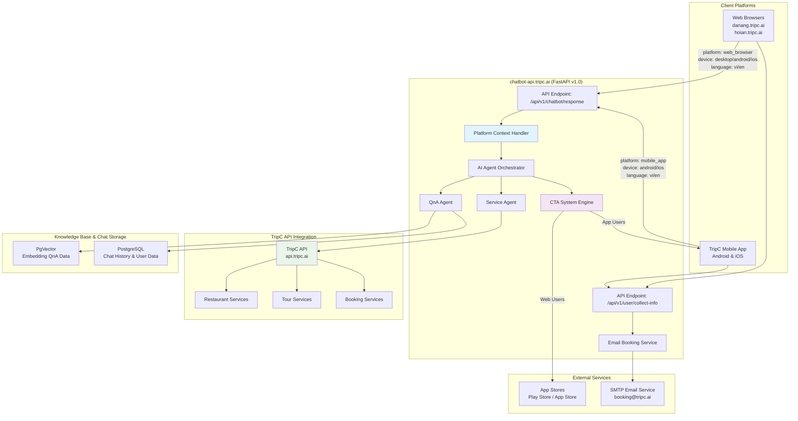
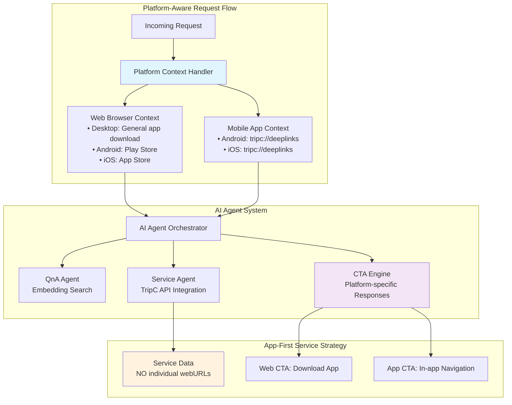
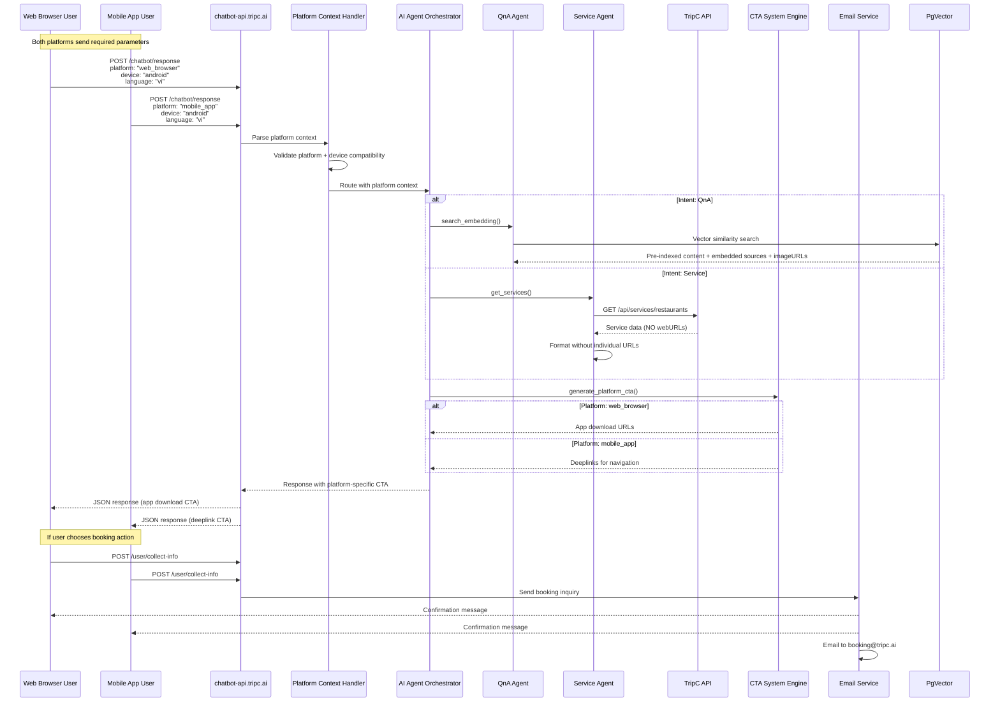
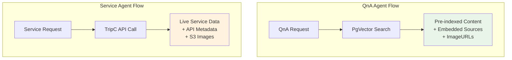

# 🧠 Thiết kế kiến trúc hệ thống TripC.AI Chatbot (Platform-Aware Architecture v1.0)

---

## 1. Kiến trúc tổng thể (Platform-Aware System)





> 📌 **App-First Architecture**: Services không có individual URLs - chỉ accessible qua TripC Mobile App. CTA System hướng web users tải app và app users dùng deeplinks.

---

## 2. Thành phần chính (v1.0 Enhancements)

### � Client Platforms

#### Web Browser Users
- **Platforms**: `danang.tripc.ai`, `hoian.tripc.ai`, các website TripC khác
- **Devices**: Desktop, Android browser, iOS browser
- **Strategy**: App-first - drive downloads thông qua CTA system
- **Service Access**: Không thể xem chi tiết dịch vụ trực tiếp, phải tải app

#### Mobile App Users  
- **Platform**: TripC Mobile App (Android & iOS)
- **Devices**: Native mobile applications
- **Strategy**: In-app navigation qua deeplinks
- **Service Access**: Full access với deeplinks `tripc://service/{id}`

---

### 🧠 Platform Context Handler (NEW)

**Chức năng chính:**
- Parse và validate request parameters: `platform`, `device`, `language`
- Set context cho downstream agents
- Ensure compatibility giữa platform và device
- Initialize CTA strategy based on platform

**Platform Detection Logic:**
```python
def detect_platform_context(request):
    if request.platform == "mobile_app":
        return MobileAppContext(device=request.device)
    elif request.platform == "web_browser":
        return WebBrowserContext(device=request.device)
    else:
        raise InvalidPlatformError()
```

---

### 🎯 AI Agent Orchestrator (Enhanced)

- **Intent Classification**: Phân loại dựa trên nội dung message
- **Platform-aware Routing**: Route request đến appropriate agents với platform context
- **Response Formatting**: Format response theo platform requirements
- **CTA Integration**: Tích hợp CTA system vào response

**Agent Routing Logic:**
- `QnA Intent` → QnA Agent với embedding search
- `Service Intent` → Service Agent với TripC API integration  
- `Booking Intent` → Trigger user info collection flow

---

### 🏢 TripC API Integration (Core Component)

**API Endpoints Integration:**
- `GET /api/services/restaurants` - Danh sách nhà hàng
- `GET /api/services/restaurants/{id}` - Chi tiết nhà hàng
- `GET /api/services/seating/{id}` - Thông tin đặt chỗ

**Service Data Processing:**
- Extract và format service data theo API v1.0 schema
- **NO webURL/deeplink** trong service objects
- Map TripC API fields to chatbot response format

**Authentication:**
```bash
Authorization: Bearer {access_token}
```

---

### 🎗️ CTA System Engine (Core Innovation)

**Platform-specific CTA Logic:**

#### Web Browser CTA
| Device | CTA Action | URL |
|--------|------------|-----|
| Desktop | General app download | `https://tripc.ai/mobileapp` |
| Android | Google Play Store | `https://play.google.com/store/apps/details?id=com.tripc.ai.app` |
| iOS | App Store | `https://apps.apple.com/vn/app/tripc-app/id6745506417` |

#### Mobile App CTA  
| Device | CTA Action | Deeplink |
|--------|------------|----------|
| Android | In-app navigation | `tripc://restaurant/{id}` |
| iOS | In-app navigation | `tripc://restaurant/{id}` |

**CTA Response Format:**
```json
{
  "device": "android",
  "label": "Tải app TripC cho Android", 
  "url": "https://play.google.com/store/...",
  // OR
  "deeplink": "tripc://restaurant/11"
}
```

---

### 🧩 Knowledge Base & Storage

- **PgVector**: Vector embedding search cho QnA Agent với pre-indexed content
- **PostgreSQL**: Chat history, user data, conversation tracking
- **Embedding Data Sources**: JSON files chứa QnA content với imageURL và sources được embed sẵn
- **QnA Sources Policy**: Tất cả imageURL và sources trong QnA response đều từ embedding data, không gọi external APIs
- **Service Data**: Comes directly từ TripC API (không từ embedding)

### 📧 Email Booking Service

- **Endpoint**: `/api/v1/user/collect-info`
- **Workflow**: User info → Email to `booking@tripc.ai` → Confirmation email
- **SMTP Fallback**: Graceful handling khi chưa config SMTP credentials
- **Action Trigger**: Activated via `collect_user_info` action in suggestions

---

## 3. Platform-Aware Request Flow (v1.0)


---

## 4. App-First Service Strategy

### 🚫 Service URL Policy

**Key Principle**: Services trong response **KHÔNG có individual webURL hoặc deeplink**

```json
{
  "type": "Service",
  "services": [
    {
      "id": 11,
      "name": "Bông",
      "type": "restaurant",
      // ❌ NO webURL field
      // ❌ NO deeplink field
      "imageUrl": "https://tripc-dev.s3.amazonaws.com/...",
      "description": "Quán Bông có không gian thoáng mát...",
      "address": "500 Núi Thành, Hải Châu, Đà Nẵng"
    }
  ],
  "cta": {
    // ✅ CTA drives app adoption or in-app navigation
    "device": "android",
    "label": "Tải app TripC để xem chi tiết",
    "url": "https://play.google.com/store/apps/details?id=com.tripc.ai.app"
  }
}
```

### 📱 Platform-specific Access Strategy

#### Web Browser Users
1. **See service list** với basic info (name, image, description)
2. **Cannot access details** directly
3. **Must download app** để xem chi tiết và đặt chỗ
4. **CTA drives app downloads** với device-specific URLs

#### Mobile App Users
1. **See service list** với basic info
2. **Use deeplinks** để navigate trong app: `tripc://restaurant/{id}`
3. **Full access** đến service details và booking features
4. **CTA enhances in-app experience**

### 🎯 CTA Logic Table

| Platform | Device | User Action | CTA Response |
|----------|--------|-------------|--------------|
| `web_browser` | `desktop` | Wants service details | General app download |
| `web_browser` | `android` | Wants service details | Play Store link |
| `web_browser` | `ios` | Wants service details | App Store link |
| `mobile_app` | `android` | Wants service details | `tripc://restaurant/{id}` |
| `mobile_app` | `ios` | Wants service details | `tripc://restaurant/{id}` |

---

## 5. Response Format Enhancements (v1.0)

### ✅ QnA Response (Platform-aware với Embedding Sources):
```json
{
  "type": "QnA",
  "answerAI": "Buổi chiều ở Đà Nẵng bạn nên ghé bán đảo Sơn Trà...",
  "sources": [
    {
      "title": "Du lịch Đà Nẵng - Hướng dẫn chi tiết",
      "url": "https://tripc.ai/danang-guide",
      "imageUrl": "https://cdn.tripc.ai/sources/guide.jpg"
      // ✅ imageUrl và sources từ embedding data (pre-indexed)
    }
  ],
  "suggestions": [
    {
      "label": "Tìm nhà hàng gần đây",
      "detail": "Khám phá các nhà hàng nổi tiếng tại Đà Nẵng", 
      "action": "show_services"
    }
  ],
  "cta": {
    "device": "desktop",
    "label": "Tải app TripC để trải nghiệm tốt hơn",
    "url": "https://tripc.ai/mobileapp"
  }
}
```

### ✅ Service Response (App-First với TripC API):
```json
{
  "type": "Service",
  "answerAI": "Dưới đây là những nhà hàng tuyệt vời tại Đà Nẵng:",
  "services": [
    {
      "id": 11,
      "name": "Bông", 
      "type": "restaurant",
      "imageUrl": "https://tripc-dev.s3.amazonaws.com/images/17b6db06-278d-4504-a120-2bd6f4a9ed79/bông.jpg",
      "address": "500 Núi Thành, Hải Châu, Đà Nẵng",
      "description": "Quán Bông có không gian thoáng mát, rộng rãi...",
      "priceRange": "$$"
      // ❌ NO webURL or individual deeplink
    }
  ],
  "sources": [
    {
      "title": "TripC API - Nhà hàng Đà Nẵng",
      "url": "https://api.tripc.ai/services/restaurants", 
      "imageUrl": "https://cdn.tripc.ai/sources/tripc-api.jpg"
      // ✅ Service sources từ TripC API metadata (not embedding)
    }
  ],
  "suggestions": [
    {
      "label": "Đặt bàn ngay",
      "action": "collect_user_info"
    }
  ],
  "cta": {
    "device": "android",
    "label": "Tải app TripC để xem chi tiết",
    "url": "https://play.google.com/store/apps/details?id=com.tripc.ai.app"
    // OR for mobile_app platform:
    // "deeplink": "tripc://restaurant/11"
  }
}
```

---

## 6. Data Sources & Attribution Strategy

### 📚 QnA Agent Sources (Embedding-based)

**Data Source**: Pre-indexed embedding data trong PgVector
```json
{
  "type": "QnA",
  "sources": [
    {
      "title": "Du lịch Đà Nẵng - Hướng dẫn chi tiết",
      "url": "https://tripc.ai/danang-guide",
      "imageUrl": "https://cdn.tripc.ai/sources/danang-guide.jpg"
      // ✅ Tất cả đều từ embedding data (pre-indexed)
    }
  ]
}
```

**Characteristics:**
- ✅ **Pre-indexed Content**: Tất cả imageURL và sources được embed sẵn
- ✅ **No Real-time APIs**: Không gọi external APIs cho QnA sources
- ✅ **Fast Response**: Vector similarity search trong pre-indexed data
- ✅ **Consistent Quality**: Curated content với verified sources

### 🏢 Service Agent Sources (TripC API-based)

**Data Source**: Real-time TripC API calls
```json
{
  "type": "Service", 
  "sources": [
    {
      "title": "TripC API - Nhà hàng Đà Nẵng",
      "url": "https://api.tripc.ai/services/restaurants",
      "imageUrl": "https://cdn.tripc.ai/sources/tripc-api.jpg"
      // ✅ Metadata from TripC API integration
    }
  ]
}
```

**Characteristics:**
- ✅ **Real-time Data**: Fresh service data từ TripC ecosystem
- ✅ **API Integration**: Direct calls to `api.tripc.ai`
- ✅ **Service Images**: `logo_url`, `cover_image_url` từ S3 bucket
- ✅ **App-first Policy**: No individual service URLs

### 🔄 Source Attribution Flow



---

## 7. Tổ chức thư mục (Platform-Aware Architecture)

```
tripc-chatbot-api/
├── pyproject.toml
├── app/
│   ├── main.py  ← FastAPI với platform-aware endpoints
│   ├── core/
│   │   ├── platform_context.py  ← NEW: Platform detection & validation
│   │   └── cta_engine.py        ← NEW: Platform-specific CTA system
│   ├── agents/
│   │   ├── ai_orchestrator.py   ← Enhanced: Platform-aware routing
│   │   ├── qna_agent.py         ← QnA with embedding search
│   │   └── service_agent.py     ← TripC API integration (NO individual URLs)
│   ├── services/
│   │   ├── email_service.py     ← Booking workflow
│   │   └── tripc_api.py         ← NEW: TripC API client
│   ├── vector/
│   │   └── pgvector_store.py    ← Vector embedding storage
│   ├── models/
│   │   ├── schemas.py           ← Platform-aware request/response models
│   │   └── platform_models.py   ← NEW: Platform context models
│   ├── llm/
│   │   └── qwen_client.py       ← AI agent LLM integration
│   └── database/
│       └── postgresql.py       ← Chat history & user data
└── README.md
```

### 🆕 New Components (v1.0)

#### `platform_context.py`
```python
class PlatformContext:
    platform: str  # mobile_app | web_browser
    device: str    # android | ios | desktop
    language: str  # vi | en

class PlatformContextHandler:
    def validate_platform_compatibility(self, platform: str, device: str) -> bool
    def create_context(self, request: ChatRequest) -> PlatformContext
```

#### `cta_engine.py`  
```python
class CTAEngine:
    def generate_web_cta(self, device: str) -> CTAResponse
    def generate_app_cta(self, device: str, service_id: str) -> CTAResponse
    def get_app_store_url(self, device: str) -> str
```

#### `tripc_api.py`
```python
class TripCAPIClient:
    def get_restaurants(self, page: int = 1, page_size: int = 10) -> List[Restaurant]
    def get_restaurant_detail(self, restaurant_id: int) -> Restaurant
    def get_seating_info(self, restaurant_id: int) -> SeatingInfo
```

---

## 8. Platform-Aware Features Summary

### ✅ **Completed Features (v1.0)**

#### Epic 1: Platform Detection & Context
- 🌐 **Platform Context Handler**: Parse và validate `platform`, `device`, `language`
- 🔧 **Platform Compatibility**: Ensure valid platform-device combinations
- 🌍 **Multi-language Support**: Vietnamese (`vi`) và English (`en`)

#### Epic 2: App-First Service Strategy
- 🚫 **No Individual Service URLs**: Services không có webURL/deeplink fields
- � **App-centric Access**: Service details chỉ accessible qua TripC App
- 🔗 **CTA-driven Navigation**: Platform-specific CTAs drive app adoption

#### Epic 3: CTA System Engine
- 🌐 **Web Browser CTAs**: Device-specific app download URLs
- 📲 **Mobile App CTAs**: Deeplinks cho in-app navigation
- 🎯 **Smart Routing**: Platform-aware CTA selection logic

#### Epic 4: TripC API Integration
- 🍽️ **Restaurant Services**: Direct integration với TripC restaurant APIs
- 🔐 **Authentication**: Bearer token authentication
- 📊 **Data Mapping**: TripC API fields → Chatbot response format

#### Epic 5: Enhanced Agent System
- 🧠 **AI Agent Orchestrator**: Platform-aware intent classification
- 📚 **QnA Agent**: Vector embedding search với pre-indexed sources và imageURLs từ embedding data
- 🏢 **Service Agent**: TripC API integration với app-first policy
- 🔍 **Embedding Sources**: QnA imageURL và sources đều từ pre-indexed embedding data (không external APIs)

### 🔄 **Backend Implementation Details**

#### Platform-Aware Endpoints
- ✅ `POST /api/v1/chatbot/response` - Requires platform/device/language
- ✅ `POST /api/v1/user/collect-info` - Platform context for booking

#### Request Validation
- ✅ **Required Fields**: `message`, `platform`, `device`, `language`
- ✅ **Platform Compatibility**: Validate platform-device combinations
- ✅ **Language Support**: vi/en với appropriate responses

#### Response Generation
- ✅ **Platform-specific CTAs**: Web app downloads vs mobile deeplinks
- ✅ **App-first Services**: No individual service URLs
- ✅ **Action-based Suggestions**: Frontend-friendly action types

---

## 9. Key Architectural Changes (v0.x → v1.0)

### 🔄 **Major Enhancements**

| **Component** | **v0.x Design** | **v1.0 Architecture** | **Business Impact** |
|---------------|-----------------|----------------------|-------------------|
| Request Format | Basic message only | Platform-aware với required fields | Better user targeting |
| Service URLs | Individual webURLs | App-first (no URLs) | Drives app adoption |
| CTA System | Simple app download | Platform-specific engine | Improved conversion |
| Agent System | Place-based search | TripC API integration + Embedding QnA | Better service data + Pre-indexed QnA sources |
| Platform Support | Web-only | Web + Mobile App dual support | Ecosystem integration |

### 🚀 **Business Strategy Implementation**

- **App-First Policy**: Web users must download app for service details
- **Unified Experience**: Same API serves both web và mobile platforms
- **Data Centralization**: All service data from TripC API (not external sources)
- **Conversion Optimization**: Platform-specific CTAs maximize app downloads

### 📊 **Technical Improvements**

- **Reduced External Dependencies**: No SerpAPI/crawler cho service data
- **Better Performance**: Direct TripC API integration
- **Scalable Architecture**: Platform context allows future expansion  
- **Unified Data Model**: Consistent service format across platforms
- **Embedding-first QnA**: imageURL và sources từ pre-indexed embedding data (không real-time API calls)

> 🎯 **Outcome**: V1.0 architecture successfully implements app-first strategy while maintaining excellent UX across platforms, driving TripC mobile app adoption through strategic service access restrictions.

---

## 10. Implementation Roadmap

### 🚀 **Phase 1 (Current - v1.0)**
- ✅ Platform-aware request handling
- ✅ App-first service policy  
- ✅ CTA system engine
- ✅ TripC API integration
- ✅ Email booking workflow

### 🔮 **Phase 2 (Future - v1.1+)**
- 🔄 **Chat Synchronization**: Cross-platform conversation continuity
- 📖 **Enhanced Chat History**: Platform-aware conversation tracking
- 🌍 **Extended Language Support**: Additional languages beyond vi/en
- 🤖 **AI Personalization**: User preference learning across platforms

### 🎯 **Success Metrics**
- **App Download Rate**: Conversion from web CTA clicks
- **In-app Engagement**: Deeplink usage in mobile app
- **Booking Conversion**: User info collection success rate
- **Platform Distribution**: Web vs mobile app usage patterns

---

## � **Contact & Integration Support**

### Technical Implementation
- **API Specification**: `tripc_ai_chatbot_api.md`
- **Platform Integration**: Supports both web và mobile app clients
- **Authentication**: TripC API Bearer token integration

### Business Integration
- **Booking System**: Email workflow to `booking@tripc.ai`
- **App Store URLs**: Pre-configured for iOS và Android
- **Deeplink Scheme**: `tripc://` for mobile app navigation

> 📌 **Documentation Ready**: Complete API v1.0 specification available for development team implementation of platform-aware, app-first TripC.AI Chatbot system.
